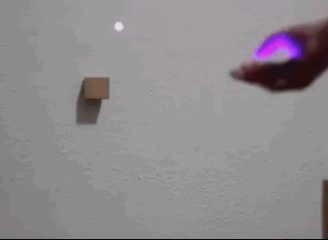

# Gallery

<iframe width="560" height="315" src="https://www.youtube.com/embed/QuBngo0n6MA" title="YouTube video player" frameborder="0" allow="accelerometer; autoplay; clipboard-write; encrypted-media; gyroscope; picture-in-picture" allowfullscreen></iframe>
Project by Lauren Schreurs
 
<iframe width="560" height="315" src="https://www.youtube.com/embed/Jp1c1dM1_1M" title="YouTube video player" frameborder="0" allow="accelerometer; autoplay; clipboard-write; encrypted-media; gyroscope; picture-in-picture" allowfullscreen></iframe>
Interactive Spaces Workshop
course at HyperIsland 2018 - Stockholm, Sweden
 

Projects by [Zaza Zuilhof](https://zaza.zuilhof.nl)
 
<iframe width="560" height="315" src="https://www.youtube.com/embed/AmxueGy1DJ0" title="YouTube video player" frameborder="0" allow="accelerometer; autoplay; clipboard-write; encrypted-media; gyroscope; picture-in-picture" allowfullscreen></iframe>
Designing Interactive Spaces
course at CIID Summer School 2018 - Copenhagen Denmark
  
<iframe src="https://player.vimeo.com/video/287547989?h=8a87cd20ba" width="640" height="360" frameborder="0" allow="autoplay; fullscreen; picture-in-picture" allowfullscreen></iframe>
A project by Ishan Sain and Aaron McKenzie. 

 
<iframe width="560" height="315" src="https://www.youtube.com/embed/e04IzNirk-o" title="YouTube video player" frameborder="0" allow="accelerometer; autoplay; clipboard-write; encrypted-media; gyroscope; picture-in-picture" allowfullscreen></iframe>
Tramontana Showreel

