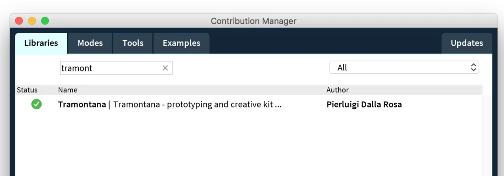

# Getting started with Processing and tramontana:

1. Download ***tramontana*** for [iOS](https://apps.apple.com/us/app/id1121069555) (or in the AppStore on your phone) or for [Android](https://play.google.com/store/apps/details?id=com.pierdr.pierluigidallarosa.myactivity)
2. Download the latest version of [Processing](https://processing.org) 
3.  Download the tramontana library and the websocket library (video how to do it [here](https://www.youtube.com/watch?v=EtIAy2Pykkg))

Now you are ready to play:

###### Put your phone and your computer on the same wifi network!

Now let’s start to write our first sketch:

The first thing you need to write is to import the libraries:

	import tramontana.library.*;
	import websockets.*;

Then create an instance of Tramontana:

	Tramontana device;

In the setup method we will open the connection with our device. To get the right address open the tramontana app on your phone and change the ip address in the line below with your device’s one:

	void setup(){
		t = new Tramontana(this,"192.168.1.17");
	}

Now you are ready to give the first instruction to your device, you can try something like:

	void mousePressed(){
	 t.makeVibrate();
	}

On mouse pressed this will make your device vibrate!

###### Congratulations, you created your first interactive experience!

<!---->
If you are curious of what is next to learn about tramontana I suggest you look at the examples here:

[A_HelloWorld](https://pierdr.github.io/Tramontana-for-Processing/examples/A_HelloWorld/A_HelloWorld.pde)

[B_ChangeColor](https://pierdr.github.io/Tramontana-for-Processing/examples/B_ChangeColor/B_ChangeColor.pde)

[C_MultipleDevices](https://pierdr.github.io/Tramontana-for-Processing/examples/C_MultipleDevices/C_MultipleDevices.pde)

[D_MotionSensor](https://pierdr.github.io/Tramontana-for-Processing/examples/D_MotionSensor/D_MotionSensor.pde)

[E_MultipleDevicesInput](https://pierdr.github.io/Tramontana-for-Processing/examples/E_MultipleDevicesInput/E_MultipleDevicesInput.pde)

[F_MultipleInputs](https://pierdr.github.io/Tramontana-for-Processing/examples/F_MultipleInputs/F_MultipleInputs.pde)

[G_Touch](https://pierdr.github.io/Tramontana-for-Processing/examples/G_Touch/G_Touch.pde)