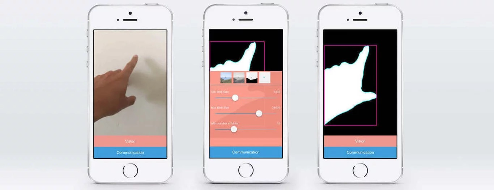

# TramontanaCV

With tramontanaCV you will be able to harness the computing power of your phone to sense people or objects in a space and collect and manipulate the result from Processing.

Before you start download [tramontanaCV for iOS](https://apps.apple.com/us/app/libretspswp/id1276040950) (Android coming soon), and join the same WiFi network as your laptop. You will be able to send information data from your phone to your Processing sketch in seconds. tramontanaCV was inspired by openTSPS by LAB at Rockwell Group.

#### Reference tramontanaCV

###### Remote Control
*available from verson 2.0*

*`lockExposure()
unlockExposure()
captureBackground()
takeScreenshot()
setBlur(float amount)
setThreshold(int amount)
setBlobs(int min, int max, int num)
setCamera(int cameraId)
switchToDetectFaces()
switchToDetectBlobs()`*

###### Callback Methods

*`onBoundingBoxReceived(TBBoxContainer container, int nBboxes, String ip)
onBlobsReceived(TBlobsContainer container, int nBlobs, String ip)
onFacesReceived(TBBoxContainer container, int nFaces, String ip)`*

###### Custom Types
	
	TBBoxContainer {
	               public TBBox[] bboxes;
	               public int nBBoxes;
	}

	TBBox {
	              public float x;
	              public float y;
	              public float w;
	              public float h;
	              public TBBox(int x, int y, int w, int h);
	              public TBBox(float x, float y, float w, float h);
	}

	TBlobsContainer {
	             public TBlob[] blobs;
	             public int nBlobs;
	}

	TBlob { 
	         public TVector[] pts;
	         public int nPts;
	         public TBlob(PApplet parent);
	         public void draw();
	}

	TVector{
	          public int x;
	          public int y;
	          public TVector(int x, int y);
	}
	
	
	
 
 
 
Tutorial on tramontanaCV:	
<iframe width="560" height="315" src="https://www.youtube.com/embed/UmwPaDm-7NM" title="YouTube video player" frameborder="0" allow="accelerometer; autoplay; clipboard-write; encrypted-media; gyroscope; picture-in-picture" allowfullscreen></iframe>